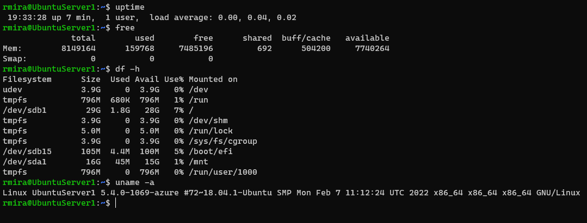
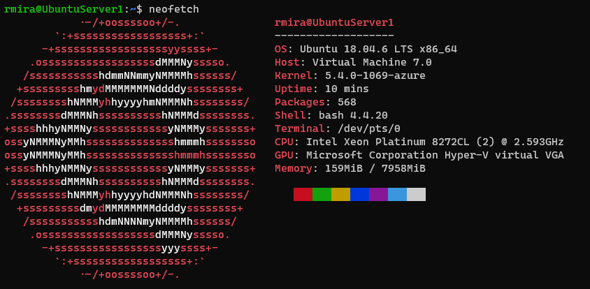

# Day 1: Get to know your server

## Introduction

For day 1 of the course, we'll be connecting remotely to our server using SSH and we'll run a few commands.

## SSH

The Secure Shell Protocol is a cryptographic network protocol for operating network services securely over an unsecured network.

The most commonly used tool is [OpenSSH](https://www.openssh.com/), an open-source software developed by OpenBSD. It is a suite of utilities, the most important being the server and client components. OpenSSH comes installed by default in most of Linux distributions.

I went through the process of connecting to the remote server via SSH in the previous section, so I thought I should try something else. I followed the instructions on how to set a config file, and set one of my own.

### The SSH config file

The SSH file is located in the `.ssh` hidden directory, and it stores configuration parameters for SSH connections. By storing the SSH configuration options in this file, you won't need to remember the different IP addresses, usernames and other parameters used to connect remotely to a machine. This information is stored in the `config` file and OpenSSH fetches it when needed.

I moved into the `.ssh` and I saw this file didn't exist, so I created it.

`touch config`

Then I changed permissions with `chmod`, to allow just myself, the user, to read it and write on it.

`chmod 600 config`

I then edited the `config` file using Nano. It looked like this (I'll omit the actual values).

```bash
Host server
    HostName 20.xxx.xx.xx
    User myusername
    Port 22
```

And it worked! I just need to type `ssh server` and I establish the connection to my server. I love it!

## A few commands

I connected to the server and ran a few commands, the basic ones. I captured some of them.



I then installed [Neofetch](https://github.com/dylanaraps/neofetch), a good looking way to display information about a system.



I noticed something with these outputs. I'm running Ubuntu 18.04 LTS. This isn't the latest LTS Ubuntu version available. The latest one is the 20.04 Focal Fossa. This one's available from the Azure marketplace, but if you don't specify it during creation, Azure will create the LTS version 18.04.

When I ran the `az vm create` command, I just had `UbuntuLTS` as the parameter for image. If you don't say anything else, Azure will deploy the 18.04.

We can be very specific with the image we want to be deployed. We can see a list of available images running the `az vm image list` command. To view the Ubuntu offers, we can run this command.

`az vm image list --offer Ubuntu --all --output table`

The thing about this command is that the output is huge. There are thousands of Ubuntu offerings.

If you want to deploy the Ubuntu 20.04, you can run this command.

`az vm create -g ResourceGroup -n VMName --image Canonical:0001-com-ubuntu-confidential-vm-focal:20_04-lts-cvm:latest --admin-username myusername --generate-ssh-keys`

There are lots of images to choose from, and I'm still not sure the differences between them. I choose this one as an example for no particular reason. Notice the `latest` after the colon. It tells Azure to fetch the latest release.

This process of choosing the VM image is maybe simpler when done from the Portal.

## Stopping the VM

To stop the VM using the Azure CLI, we run this command.

`az vm stop -g ResourceGroup -n VMName`

This will power off the virtual machine, but it will continue to be billed. To stop billing us, we need to run `az vm deallocate`, like that.

`az vm deallocate -g ResourceGroup -n VMName`

## Conclusion

This has been an incredible exercise. I loved learning about the `config` file for SSH. It's super helpful.
