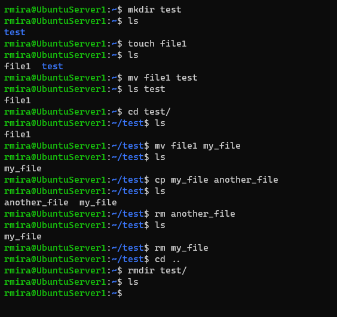

# Day 2: Basic navigation

## Introduction

As system administrators, we need to be familiarized with the command line, and know how to move around the system without the aid of a graphical user interface. It may feel weird in the beginning, but we need to learn to love the command line.

## The Linux file system

One aspect of the Linux file system that might struck us as odd is the fact that everything in Linux is treated as a file. Directories are files too.

A handy way to visualize the file system's structure is with the Tree tool. This one doesn't come installed by default. We can install it like this.

`sudo apt install tree`

Everything branches off from the root directory, which is represented by a `/`. There's nothing above root. To visualize the directories that branch off from the root directory, we use the tree command like so.

`tree -L 1 /`

And this is the output of this command just below. The `-L 1` option tells the command to display just the first level of directories branching off from the root directory.

## Navigating the file system

Most Linux distributions will have roughly the same file structure, with the same names, as the one above.

### The directories

#### /bin

It holds the binaries, or applications and programs we can run. Some of the commands we use, like `ls`, can be found here.

#### /boot

This directory contains the files required to startup the system.

#### /dev

This directory contains device drivers. Some of the files that appear here are generated the moment a device connects to the system.

#### /etc

`/etc` contains most of the system-wide configuration files, such as disk configuration files, users and groups, and host names.

#### /home

`/home` is where we'll find the users' personal files and directories.

#### /lib

This directory is where libraries live. Libraries are files containing code that your applications can use. They contain snippets of code that applications use to draw windows on your desktop, control peripherals, or send files to your hard disk.

#### /media

Here is where external storage will be automatically mounted when you plug it in and try to access it.

#### /mnt

This is where you would manually mount storage devices or partitions.

#### /opt

The `/opt` directory is often where software you compile (that is, you build yourself from source code and do not install from your distribution repositories) sometimes lands. Applications will end up in the `/opt/bin` directory and libraries in the `/opt/lib` directory.

#### /proc

`/proc`, like `/dev` is a virtual directory. It contains information about your computer, such as information about your CPU and the kernel your Linux system is running.

#### /root

This is the home directory of the superuser (also known as the “Administrator”) of the system.

#### /run

System processes use this directory to store temporary data.

#### /sbin

`/sbin` is similar to `/bin`, but it contains applications that only the superuser (hence the initial s) will need.

#### /usr

The `/usr` directory was where users’ home directories were originally kept back in the early days of UNIX. Now `/home` is where users keep their files. These days, `/usr` contains a mish-mash of directories which in turn contain applications, libraries, documentation, wallpapers, icons and a long list of other stuff that need to be shared by applications and services.

#### /srv

The `/srv` directory contains data for servers.

#### /sys

`/sys` is another virtual directory like `/proc` and `/dev` and also contains information from devices connected to your computer.

#### /tmp

`/tmp` contains temporary files, usually placed there by applications that you are running.

#### /var

Typically contains variable-length files such as log and print files and any other type of file that may contain a variable amount of data.

### Basic commands

These are the commands we'll probably use most often.

#### pwd

To find out where we are in the file system, we use the `pwd` command, which stands for **print working directory**.

#### cd

To move around the file system, and jump from one directory to another, we use the `cd` (change directory) command. When specifying a directory to change to, you can use either absolute or relative path names. The absolute or full path starts from the system root `/`, and the relative path starts from your current directory.

On Unix-like operating systems, the current working directory is represented by a single dot (`.`). Two dots (`..`) represent the parent directory or the directory immediately above the current one. To move to the directory directly above the one we are currently in, we use `cd ..`. To move two levels up, we use `cd ../../`.

To change back to the previous working directory, we use `cd -`.

This is how some of these commands look like.

#### ls

The `ls` (list) command will list the contents of a directory. 

When used with no options and arguments, `ls` displays a list of the names of all files in the current working directory.

The `-l` option displays the files in a long listing format.

`ls -l`

To display all the files in a directory, including the hidden files, we use the `-a` option. Hidden files begin with a `.`.

`ls -a`

We can combine the different options in one single command.

`ls -la`

The output of this command looks like this. Here you won't see any hidden files because I was at the root directory. Maybe I should have chosen another directory for this exercise.

#### Creating directories and files

To create a new directory we use the `mkdir` command, followed by the directory's name.

To create a new file we use the `touch` command, followed by the file's name.

We can create multiple directories or files in a single command by typing the names separated by a space.

`touch file1 file2 file3`

To copy a file we use the `cp` command. The `mv` command is used to move files, but it can also be used to rename a file.

To remove a file, we use the `rm` command, and to remove a directory, `rmdir`. Be aware that to remove a directory with this command, the directory must be empty.

## man pages

The `man` command will probably be your best friend. It displays the manual page of a command. To use it, we type `man` followed by the name of the command. To see the manual page for the `ls` command, we type `man ls`.

## Conclusion

I still want to go deeper in this lesson, and customize my shell prompt. The `pushd` and `popd` commands are great, and I just had a quick look into them. I see their usefulness, but right now I feel I need to focus more on the basics.