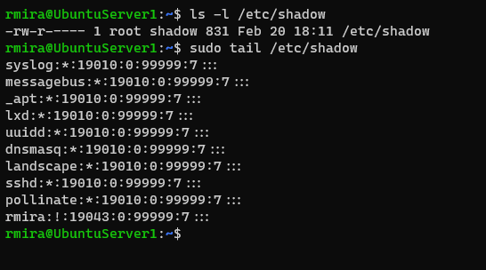
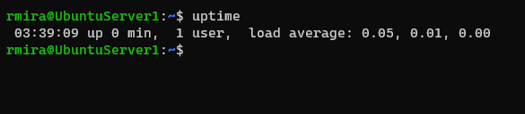
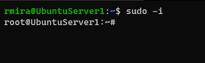
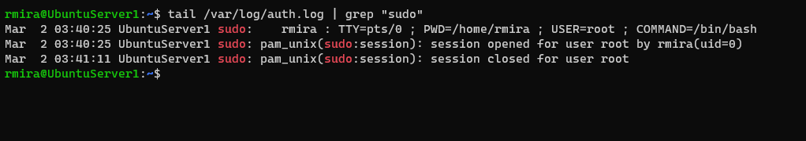
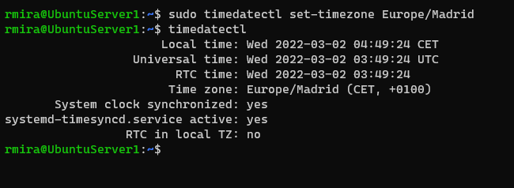

# Power trip!: Working with sudo, uptime, timezones, changing your hostname

## The root user

In Linux, there is a SuperUser named **root**. The SuperUser can do anything and everything, and thus doing daily work as the SuperUser can have dangerous consequences. You could type a command incorrectly and destroy the system. Ideally, you run as a user that has only the privileges needed for the task at hand. In some cases, this is necessarily root, but most of the time it is a regular user.

By default, the root account password is locked in Ubuntu. This means that you cannot login as root directly or use the su command to become the root user. However, since the root account physically exists it is still possible to run programs with root-level privileges. This is where `sudo` comes in - it allows authorized users to run certain programs as root without having to know the root password. This means that in the terminal you should use `sudo` for commands that require root privileges. Simply prepend sudo to all the commands you need to run as root.

### Using sudo

One example of the use of `sudo` is to allow us access to certain files in the system. The `/etc/shadow` file is one of them. This file is where all the encrypted user passwords are stored. It contains very sensitive information, therefore just the root user is allowed access to it.

There are a number of commands we can use to display the contents of a file to the screen. We can use `cat` to display the entire file to the screen. If the file is to large and doesn't fit in the terminal window, it will scroll down all the way to the bottom, and we'll see just the very last portion of it. We can use `less` to display the contents of a large file one page at a time. To go forward to the next page in the file, we press `f` or the `space bar`. To go back to the previous page, we press `b`. 

To see the `/etc/shadow` file in this manner, we'd type this.

`sudo less /etc/shadow`

If the file is too long and we want to see just its very last lines,we can use the `tail` command. By default, it displays the last 10 lines of the file, but we can modify the command with the `-n` flag, followed by the number of lines we want to display.

If we want to display the last 30 lines of `/etc/shadow` we would do it like this.

`sudo tail -n 30 /etc/shadow`

I ran it without any modifiers and the output looks like this.

Another command that is off-limits to regular users is the `reboot` command. As the name implies, this command will reboot the system.

`sudo reboot`

After a minute or so had passed I logged into the system, and ran `uptime`. We can see the system had been running for less than one minute.

If we need to run several commands as `root`, we can launch the root login shell. Like so.

`sudo -i`

When we run this command, the prompt changes so we know we're working as the root user.

Use this feature carefully! To go back to the regular user, simply type `exit` or `logout`.

## Checking the system authentication logs

We can consult the `/var/log/auth.log` file to see the user logins and authentication mechanisms used.

A very powerful tool in Linux is the `grep` command. We use it to search for a string of characters in a file. It comes in handy when working with large files.

This is what I did to find the term `sudo` in the `/var/log/auth.log` file.

## Changing the hostname

To change the hostname of our server, we use the `hostnamectl` command, like so.

`sudo hostnamectl set-hostname myserver`

## Changing the time zone

To change the time zone of the server's clock, we use the `timedatectl` command.

We can consult the available time zones we can use by running the following command.

`timedatectl list-timezones`

Since I'm in Spain, I chose **Europe/Madrid** for my server. To change the time zone we use the `set-timezone` argument. Like so.

`sudo timedatectl set-timezone Europe/Madrid`

I then ran `timedatectl` to comfirm my changes.

## Conclusion

I feel like we're really starting with the administrative tasks. The hostname and time zone are two super important things that might pass undetected by many folks without a SysAdmin mentality. I love it. It organizes things, and makes it easier for the SysAdmin to navigate his or her way around.
