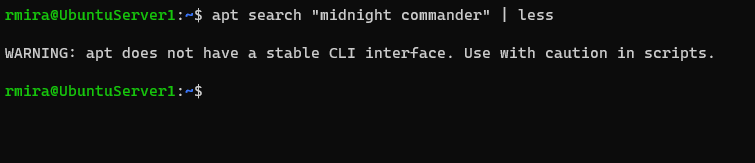
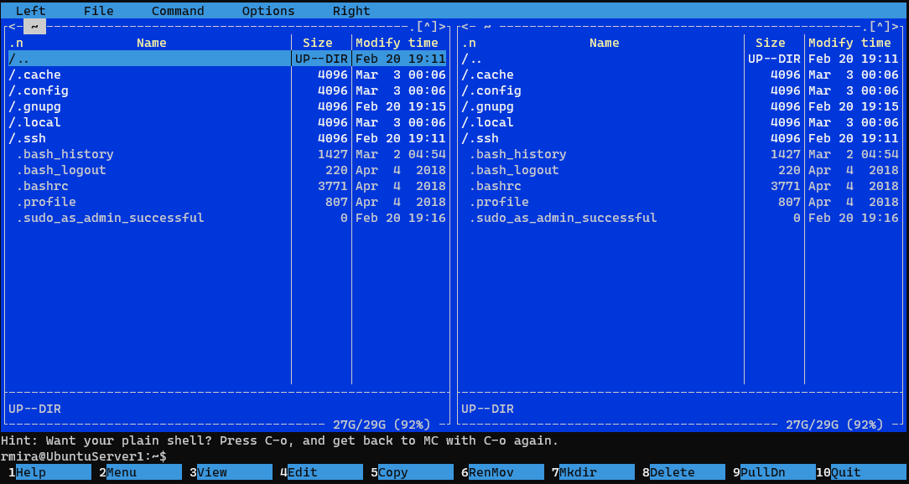

# Day 4: Installing software and exploring the file structure

Today we'll install some software.

## Installing software in Debian based distributions (like Ubuntu)

In Linux, software comes in packages. Ubuntu features a comprehensive package management system for installing, upgrading, configuring, and removing software.

Debian package files typically have the extension .deb, and usually exist in repositories which are collections of packages found online or on physical media, such as CD-ROM discs. Packages are normally in a pre-compiled binary format; thus installation is quick and requires no compiling of software.

Many packages use dependencies. Dependencies are additional packages required by the principal package in order to function properly.

### apt

The apt command is a powerful command-line tool, which works with Ubuntu’s Advanced Packaging Tool (APT) performing such functions as installation of new software packages, upgrade of existing software packages, updating of the package list index, and even upgrading the entire Ubuntu system.

## Installing Midnight Commander

Midnight Commander is a Text User Interface (TUI) file manager.Its aim is to make it easier to navigate the file system and manage files from the command line.

A TUI facilitates interaction between users and their systems in a visually oriented way instead of typing commands. While lacking in visual components compared to a graphical user interface (GUI), a TUI offers windows, panels, menus, and mouse support.

The apt tool can help us locate the name of the package if we're not sure how it's called. We can search by the name **Midnight Commander** like so.

`apt search "Midnight Commander"`

I tried this command and the output was quite lengthy. I then thought that it should be possible to use `less` with this command, like so.

`apt search "Midnight Commander" | less`

This actually worked, and I could navigate the output as I would normally, with the space bar. It showed me a warning message, however.

The package to install Midnight Commander is called `mc`. To install this software, we run the following command.

`sudo apt install mc`

Remember that the task of installing software is a privileged one, and it needs the `sudo` super power.

And this is the Midnight Commander in action.

It looks super cool!

## Further exploring the file system.

Midnight Commander is a cool way to explore the file structure. A big surprise for me, however, was the **filesystem hierarchy** man page.

`man hier`

> **The man command is definitely your best friend in Linux!**
