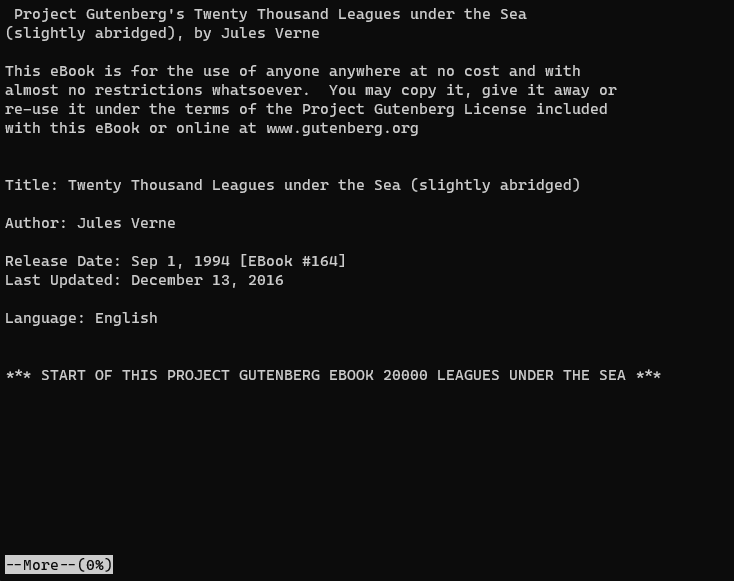
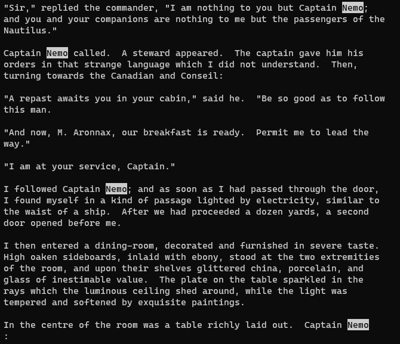
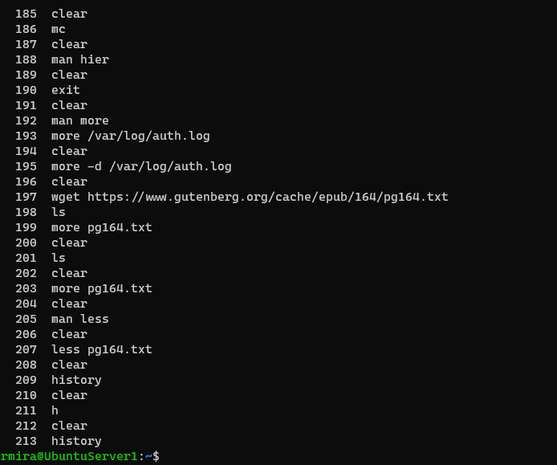

# Day 5: More or less...

## More and less

`more` and `less` are two similar commands used to view text files on the terminal screen and navigate around them. Both display one page at a time on the screen. Although both can accomplish similar results, `less` has more features and it's more powerful.

### more

We can always `man` to learn about commands.

`man more`

From the start, we can see that `more` is old, because it says it's used for CRT viewing. We haven't been using CRT monitors for years!

The syntax for `more` is as follows.

`more [-options] [-num] [+/pattern] [+linenum] [file_name]`

There are lots of things we can do with this command. I saved [this article](https://www.geeksforgeeks.org/more-command-in-linux-with-examples/) to read later. For now, I'll just stick to the basics.

I tried this command with Jules Verne's *Twenty Thousand Leagues Under the Sea*. This is one of my favorite books. I thought it would be fun to explore it in the command line. :smiley:

To download the text version of this book, I did this.

`wget https://www.gutenberg.org/cache/epub/164/pg164.txt`

This is the beginning of the file.

To move down the file one line at a time, we hit **Enter**. To move one page at a time, we hit the **space bar**. To see more functionalities, we hit `h`.

### less

The description for the `less` command in its man page is funny. It says it's the opposite of more. :laughing:

It has indeed more features, and it seems that folks like it more, and it's more popular.

Similar to `more`, we can move one line at a time by hitting **Enter**, but we can also use the up and down arrows, which is very handy.

To search for a term, we use `/`, followed by the term we want to search. I searched for **Nemo**. To move to the next occurrence of the term, we hit `n`, and to move back to the previous one, we hit `N`. And like `more`, by typing `h`, we can learn more about the many features of `less`.

[This article](https://www.thegeekstuff.com/2010/02/unix-less-command-10-tips-for-effective-navigation/) shows more stuff we can do with `less`.

## Tab completion and history

This is one of the miracles we have to be thankful for! We don't need to finish typing the entire command or the file name. By hitting the *Tab key**, the system does it for us. It's magic and it's beautiful.

The `history` command is awesome too. I learned a lot about this command in this lesson.

By typing `history`, we see all (maybe not all) the commands we previously typed in the terminal.

I keep clearing my screen all the time! Hitting **ctrl+L** is much easier.

To re-run a command from history, we type `!` followed by the number to the left of the command. If I wanted to run `more /var/log/auth.log` again (number 193), I'd run the following command.

`!193`

When you hit Enter, the name of the command will be displayed, and the command will be executed.

If we want to see just a specific number of previous commands from our history, we run `history` followed by the number of commands we want to see. If we want to see the last 10 commands, we run the following.

`history 10`

To run the last command, there are two ways: we can type `!-1` or `!!`.

We can type `!` followed by the name of a command and the shell will execute the last command with that name. To run the last `man` command, we do it like that.

`!man`

## Hidden files

In Unix systems, files that start with a dot(`.`) are hidden. It means that we won't see them immediately when we run `ls`. To list all the files in a directory, including the hidden ones, we need to append the `-a` flag to `ls`. And if we want to view the output of `ls` as a list, with files presented to us one below the other, we include the `-l` flag. Like so.

`ls -la`

These files that are hidden from us are usually configuration files, and reside in our home directory. One example is the `.bashrc` file. It's a script file that’s executed when a user logs in. The file contains a series of configurations for the terminal session that include setting up or enabling coloring, completion, shell history, command aliases, and more.

To see this file, we can use `cat`.

`cat .bashrc`

We can edit the `.bashrc` file and customize it to our liking. [This article](https://www.journaldev.com/41479/bashrc-file-in-linux) covers a lot of stuff. To edit the `.bashrc` file we can use the text editor of our preference. I like **nano**. To open the file in nano, we do it like this.

`nano .bashrc`

## nano

**GNU nano** is an easy to use command line text editor for Unix and Linux operating systems. It includes all the basic functionality you’d expect from a regular text editor, like syntax highlighting, multiple buffers, search and replace with regular expression support, spellchecking, UTF-8 encoding, and more.

**nano** is great for beginners. You can open it and immediately accomplish things.

## Conclusion

I'm learning new things with every lesson. I love how the lessons focus on productivity and how to use the commands to be more efficient. The `less` command is super important and powerful. I didn't know it could do all of these things! I'll keep using it, and exploring its features.