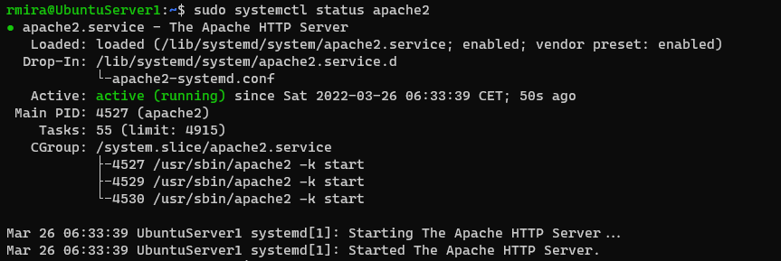
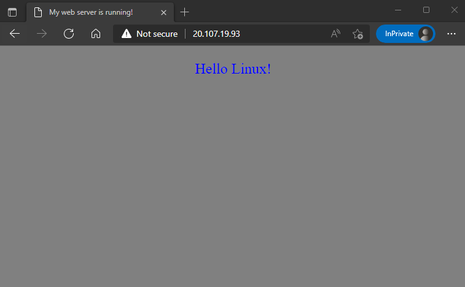
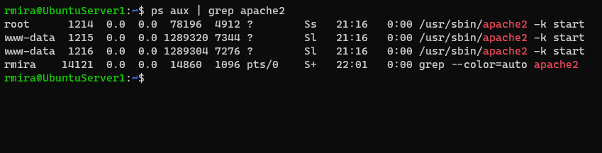
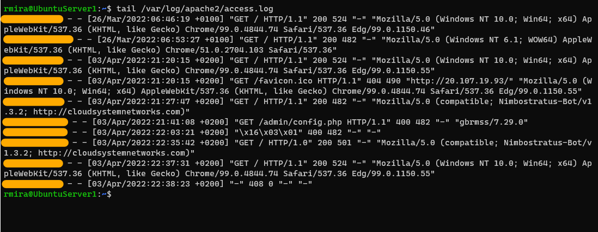

# The server and its services

For this exercise we'll install the [Apache web server](https://httpd.apache.org/). Apache is one of the most common web server softwares in the market.

## Installing Apache

To install Apache in Ubuntu, we run the following command.

`sudo apt install apache2`

Once installation finishes, Apache will be running. To verify it, we can run the `systemctl` command, like so.

`sudo systemctl status apache2`

This is the output of this command.

Apache is now serving a default web page that we can visit by typing our server's public IP address in a browser.

The file we can see, also known as the directory index, can be found at `/var/www/html/index.html`.

I edited this file with **nano** and replaced it with something very simple. This is what it looks like.

## Managing the Apache process

As we saw above, after installing Apache, it runs by default. Apache is a service, or a process, running in our server.

We can use the `ps` command to display information about the processes running in our system. To display all the processes related to Apache, we can run the following command.

`ps aux | grep apache 2`

And this is the output of this command.

The second column shows the PID, or process ID. This is a unique number that identifies the process.

We use the **systemctl** utility to manage processes in systems that use [systemd](https://www.linode.com/docs/guides/what-is-systemd/). Most of the modern Linux distributions rely on systemd to manage processes.

We already saw one command up here. Let's see others.

To stop the Apache service.

`sudo systemctl stop apache2`

If we try to load our page when the service is stopped, we'll get no response.

To start the Apache service.

`sudo systemctl start apache2`

Apache is enabled by default once we install it. If we don't want it to start at boot time, we can disable this feature.

`sudo systemctl disable apache2`

If we want to enable this feature.

`sudo systemctl enable apache2`

To restart the service.

`sudo systemctl restart apache2`

`systemctl` is a powerful utility. Be sure to check the man page to learn more.

## Viewing logs

Logs are usually kept at `/var/log`. In our case, with Apache, we'll find our logs at `/var/log/apache2`. We'll find these 2 files in this directory: `access.log`, and `error.log`.

The `access.log` file contains the data for all requests processed by the Apache server. This is what it looks like.

In Livia's video, she hid the IP addresses, so I did it too.

### Understanding the format

When generating log files, web servers use the **Common Log Format**, and it looks like this.

`127.0.0.1 - userid [10/Dec/2021:13:55:36 +0200] "GET /server-status HTTP/1.1" 200 524`

- **127.0.0.1** - IP address of the client that made the request;
- The **hyphen** defining the second field in the log file is the identity of the client. This field is often returned as a hyphen and Apache’s HTTP server documentation recommends that this particular field not be relied upon except in the case of a controlled internal network.
- **userid** - userid of the person requesting the resource;
- **[10/Dec/2021:13:55:36 +0200]** - date and time of the request;
- **"GET /server-status HTTP/1.1"** - request type and resource being requested;
- **200** - HTTP response status code;
- **524** - size of the object returned to the client.
